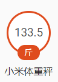

# xiaomi_scales
**仅添加Ha新版支持,方便接入,本人无任何功劳.如有侵权立马删除.**


### 插件作者原帖

https://bbs.hassbian.com/thread-16-1-1.html




### HACS

```
https://github.com/sonicmingit/xiaomi_scales
```


### yaml配置

```yaml
sensor:
  #小米体重秤
  - platform: xiaomi_scale
    mac: 'xx:xx:xx:xx:xx:xx'
    name: scales

homeassistant:
  customize:
    sensor.scales:
      friendly_name: 小米体重秤
      icon: mdi:scale-bathroom
      unit_of_measurement: '斤'
```

